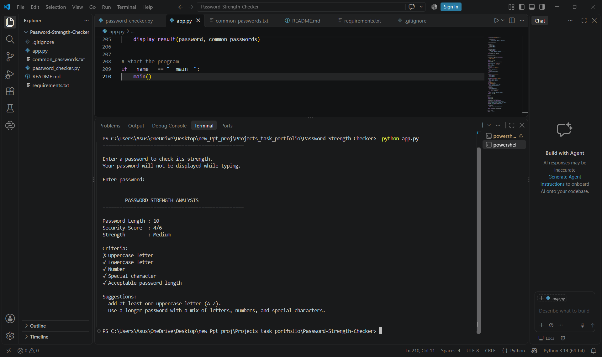

# 🔐 Password Strength Checker

A web-based **Password Strength Checker** built with Python and Flask. The application analyzes a password based on its length, character complexity, common-password usage, repeated characters, and predictable patterns.

It provides a security score, strength classification, and suggestions to help users create stronger passwords.

## 🚀 Features

* 🔐 Secure password input
* 👁 Show/hide password option
* 📊 Password security score
* 🔴 Weak / 🟡 Medium / 🟢 Strong classification
* 📏 Password length analysis
* 🔠 Uppercase letter detection
* 🔡 Lowercase letter detection
* 🔢 Number detection
* 🔣 Special character detection
* ⚠️ Common-password detection
* 🔁 Repeated-character detection
* 🔍 Predictable sequence detection
* 💡 Password improvement suggestions
* 🌐 Browser-based dashboard using Flask

## 🛠️ Technologies Used

* **Python**
* **Flask**
* **HTML**
* **CSS**
* **Regular Expressions**
* **getpass / secure input handling**
* **Text-based password dictionary**

## 📂 Project Structure

```text
Password-Strength-Checker/
│
├── app.py
├── common_passwords.txt
├── requirements.txt
├── README.md
└── .gitignore
```

### `app.py`

Main Flask application containing the password analysis logic and web dashboard.

### `common_passwords.txt`

Contains a list of commonly used passwords used to identify easily guessable passwords.

### `requirements.txt`

Contains the Python dependencies required to run the application.

### `.gitignore`

Prevents unnecessary files such as Python cache files, virtual environments, and IDE files from being uploaded to GitHub.

## 🔍 Password Analysis

The application checks the following characteristics:

| Criteria             | Description                                            |
| -------------------- | ------------------------------------------------------ |
| Length               | Checks whether the password has sufficient characters  |
| Uppercase            | Checks for A–Z characters                              |
| Lowercase            | Checks for a–z characters                              |
| Numbers              | Checks for 0–9                                         |
| Special Characters   | Checks for symbols such as `@`, `#`, `$`, `%`, `!`     |
| Common Password      | Checks against the password dictionary                 |
| Repeated Characters  | Detects excessive repeated characters                  |
| Predictable Patterns | Detects sequences such as `1234`, `abcd`, and `qwerty` |

## 📊 Strength Classification

The password is assigned a score based on multiple security criteria.

| Score | Strength  |
| ----: | --------- |
|   0–2 | 🔴 Weak   |
|   3–4 | 🟡 Medium |
|   5–6 | 🟢 Strong |

Longer passwords receive additional points because password length is an important factor in resisting brute-force attacks.

## 💡 Example

### Weak Password

```text
password123
```

Possible results:

```text
Strength: Weak
```

The application identifies it as a commonly used password and recommends creating a stronger one.

### Medium Password

```text
Hello123
```

The password contains uppercase letters, lowercase letters, and numbers, but lacks a special character and has limited length.

### Strong Password

```text
Blue@River92!Moon
```

This password contains:

* Uppercase letters
* Lowercase letters
* Numbers
* Special characters
* A longer length

## ▶️ Installation

### 1. Clone the repository

```bash
git clone https://github.com/johnvalentina1413-stack/Password-Strength-Checker.git
```

### 2. Open the project directory

```bash
cd Password-Strength-Checker
```

### 3. Install dependencies

```bash
pip install -r requirements.txt
```

### 4. Run the application

```bash
python app.py
```

### 5. Open the dashboard

Open your browser and visit:

```text
http://127.0.0.1:5000
```

## 🔐 Security Considerations

The application is designed as an educational password-analysis tool.

* Passwords are analyzed during the current session.
* Passwords are not intentionally stored in a database.
* Passwords are not uploaded to GitHub.
* The common-password dictionary contains generic passwords only.
* Users should never enter their real or sensitive passwords into an educational testing application.

## 🎯 Learning Objectives

This project demonstrates practical concepts related to:

* Password security
* Authentication security
* Brute-force attack prevention
* Password complexity
* Pattern detection
* Regular expressions
* Python programming
* Flask web development
* Secure handling of password input

  ## 🖥️ Dashboard



## 🔮 Future Improvements

Possible future enhancements include:

* Password entropy calculation
* Larger password dictionaries
* Keyboard-pattern detection
* Detection of personal information in passwords
* Password breach checking using a privacy-preserving API
* Password generator
* More advanced password-strength algorithms
* Responsive UI improvements

## 👩‍💻 Author

**John Valentina**

BSc IT Student | Cybersecurity Enthusiast
